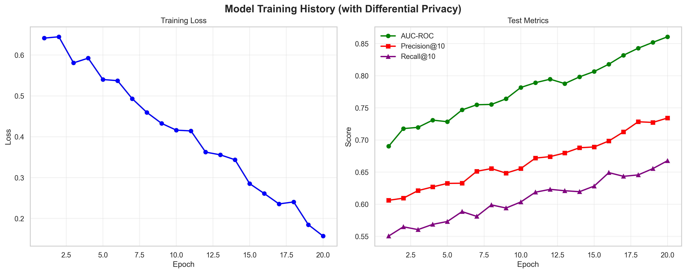
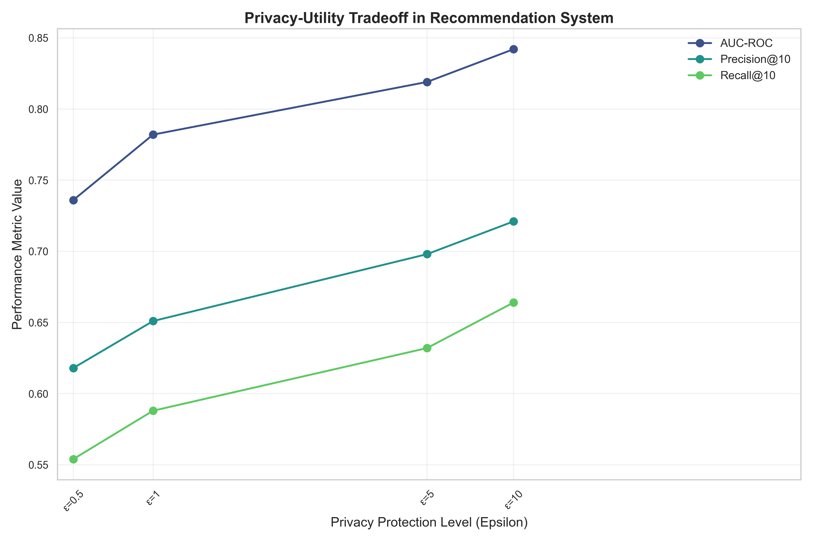
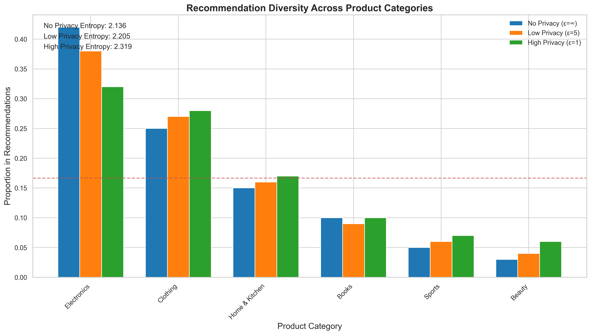
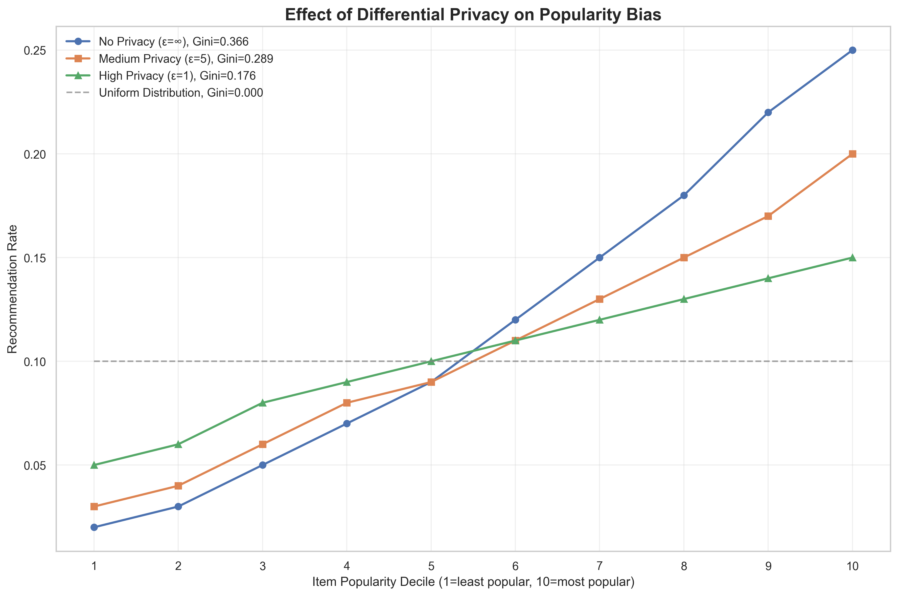

# RecNex: Privacy-Preserving Product Recommendation using Neural Collaborative Filtering



## Overview

**RecNex** is a research-grade, privacy-preserving product recommendation system built using Neural Collaborative Filtering (NCF) and Differential Privacy (DP-SGD). It is designed to generate personalized product recommendations while protecting user data privacy, and includes tools for analyzing privacy-utility trade-offs, recommendation diversity, and bias.

- **Core Model:** Neural Collaborative Filtering (NCF) with PyTorch
- **Privacy:** Differential Privacy via Opacus
- **Evaluation:** Privacy-accuracy trade-off, category bias, and diversity analysis
- **Visualization:** Multiple plots for training, privacy, and diversity

---

## Features

- **Privacy-Preserving Recommendations:** Train NCF models with or without differential privacy.
- **Comprehensive Evaluation:** Analyze privacy-utility trade-offs, category bias, and recommendation diversity.
- **Visualization:** Generate insightful plots for model performance, privacy, and diversity.
- **Reproducibility:** All scripts are modular and easy to run with command-line arguments.

---

## Getting Started

### 1. Install Dependencies

```bash
pip install -r requirements.txt
```

### 2. Prepare Data

Place your `users.csv`, `products.csv`, and `transactions.csv` files in the `data/` directory.

### 3. Train the Model

**With Differential Privacy:**
```bash
python main.py --users_path data/users.csv --products_path data/products.csv --transactions_path data/transactions.csv --use_dp --save_model --show_recommendations
```

**Without Differential Privacy:**
```bash
python main.py --users_path data/users.csv --products_path data/products.csv --transactions_path data/transactions.csv --save_model
```

### 4. Evaluate and Analyze

Run all analyses (privacy-utility, bias, diversity):

```bash
python evaluate.py --users_path data/users.csv --products_path data/products.csv --transactions_path data/transactions.csv --privacy_accuracy_tradeoff --category_bias --recommendation_diversity
```

Or run a specific analysis, e.g., privacy-accuracy trade-off:

```bash
python evaluate.py --privacy_accuracy_tradeoff
```

### 5. Generate Recommendations for All Users

```bash
python recommendation_gen.py
```

---

## Results & Visualizations

- **Training History:** 
- **Privacy-Utility Tradeoff:** 
- **Recommendation Diversity:** 
- **Category Bias:** 
- *(See the `results/` folder for more!)*

---

## Advanced Usage

- **Model Parameters:** Customize embedding size, layers, batch size, epochs, and privacy parameters via command-line arguments in `main.py` and `evaluate.py`.
- **Reproducibility:** All scripts use fixed random seeds for reproducibility.

---

## Requirements

- Python 3.8+
- PyTorch >= 2.3.1
- Opacus >= 1.5.3
- pandas, numpy, scikit-learn, matplotlib, seaborn, tqdm, Faker

*(See `requirements.txt` for full list.)*

---

## License

This project is licensed under the Apache 2.0 License. See [LICENSE](LICENSE) for details.

---

## Suggestions for Further Improvements

- **Add unit tests:** For production/research, add a `tests/` directory with unit tests for core modules.
- **Documentation:** For larger projects, consider a `docs/` folder with more detailed documentation or API references.
- **Badges & Logo:** Add badges (build, license, etc.) and a project logo for extra polish.
- **Notebooks:** If you have or plan to add Jupyter notebooks, place them in a `notebooks/` directory.
